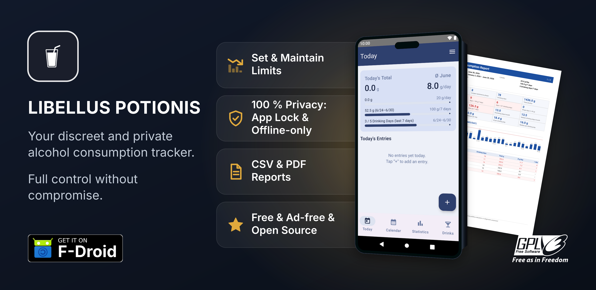

<!-- vim: set et ts=4:
=============================================================================
Libellus Potionis - Privacy-Friendly Alcohol Tracker
Copyright (c) 2026 Martin A. Godisch <martin@godisch.de>
=============================================================================

This program is free software: you can redistribute it and/or modify it under
the terms of the GNU General Public License as published by the Free Software
Foundation, either version 3 of the License, or (at your option) any later
version.

This program is distributed in the hope that it will be useful, but WITHOUT
ANY WARRANTY; without even the implied warranty of MERCHANTABILITY or FITNESS
FOR A PARTICULAR PURPOSE.  See the GNU General Public License for more
details.

You should have received a copy of the GNU General Public License along with
this program.  If not, see <https://www.gnu.org/licenses/>.

In addition, as permitted by section 7 of the GNU General Public License,
this program may carry additional permissions; any such permissions that
apply to it are stated in the accompanying COPYING.md file.

=============================================================================
-->

# Libellus Potionis - Privacy-Friendly Alcohol Tracker

## About the App (v0.82.0)

**Libellus Potionis** is a privacy-first, free, open-source, and ad-free
alcohol consumption tracker designed to help users monitor, pace, and manage
their drinking habits entirely offline. It requires absolutely no invasive
device permissions—no camera, microphone, or location access—and completely
operates without network connectivity.

It runs on both **Android** and **iOS**. The two are separate native apps in
this one repository — Kotlin/Jetpack Compose for Android, Swift/SwiftUI for iOS —
that share the same design, the same feature set, and a common JSON backup format,
so a backup exported on one platform imports on the other. Their behaviour is kept
in lock-step by a shared set of golden test vectors.

### Key Features

*   **Intelligent Logging:** Predefine custom beverages or use internationally
    common presets. Log drinks instantly or retroactively with precise
    timestamp corrections.
*   **Concurrent Limit Tracking:** Set three simultaneous boundaries—a daily
    limit (in grams of pure alcohol), a weekly rolling 7-day limit (in grams),
    and a maximum number of drinking days per week. Visual progress bars keep
    you informed in real time.
*   **Blood Alcohol Concentration (BAC) Estimation:** Input your body weight to
    get a live approximation of your BAC based on the established Widmark
    formula.
*   **Addiction Counseling Reports:** Generate a professional, highly organized
    two-page PDF report designed specifically for consultations and counseling
    appointments, providing a clear statistical analysis of your habits.
*   **Data Portability:** Export your complete dataset as a standard CSV file
    for external processing (e.g., in LibreOffice Calc) or create secure JSON
    backups to easily migrate data between devices.
*   **Granular Adjustments:** Customize your "day start" time (ensuring
    late-night drinks count toward the correct evening) and define custom
    evaluation start dates for clean restarts.

A comprehensive User's Guide is fully accessible in-app. The app is available
on [F-Droid](https://f-droid.org/packages/de.godisch.potillus).

## Quick start

1. **Install** Libellus Potionis from
   [F-Droid](https://f-droid.org/packages/de.godisch.potillus).
2. **Log your first drink.** Open the app; on the **Today** screen, tap the
   **plus** button and pick a common preset (or define your own beverage). It
   is logged instantly — you can also correct the timestamp for a drink you had
   earlier.
3. **See where you stand.** The Today screen immediately shows the grams of
   pure alcohol you have consumed today, your progress toward your daily and
   rolling 7-day limits (as bars), and your drinking-days count for the week.
4. **Optional — personalize.** In **Settings** you can set your daily, weekly,
   and drinking-days limits, enter your body weight for a live blood-alcohol
   (BAC) estimate, and enable the fingerprint lock.
5. **Optional — export.** Generate a two-page **PDF report** for a counseling
   appointment, export a **CSV** for a spreadsheet, or create a **JSON backup**
   to move your data to another device.

The in-app User's Guide explains every screen and feature in full.

## Feedback & Contributing

Feedback, bug reports, and enhancement requests are welcome. The preferred
channel is the issue tracker of the canonical repository at
[Codeberg](https://codeberg.org/godisch/potillus/issues); if you would rather
not use the tracker, you may instead write to
[android@godisch.de](mailto:android@godisch.de).

Code and documentation contributions are welcome too. The contribution
process — how changes are proposed and reviewed, together with the
architecture, coding, testing, and release conventions a change must follow —
is documented in
[CONTRIBUTING.md](https://codeberg.org/godisch/potillus/src/branch/main/CONTRIBUTING.md).

All participants are expected to follow the project's
[Code of Conduct](https://codeberg.org/godisch/potillus/src/branch/main/docs/CODE_OF_CONDUCT.md).

## Security

To report a security vulnerability, please do **not** open a public issue.
Instead, follow the private, PGP-encrypted reporting process described in
[SECURITY.md](https://codeberg.org/godisch/potillus/src/branch/main/SECURITY.md).

## Technical Aspects

### Privacy & Security Architecture

Built with an unwavering commitment to user privacy, Libellus Potionis
prioritizes absolute data sovereignty through a strict data-minimization
architecture. It operates under a minimal permission profile that completely
excludes network access, ensuring that personal data never leaves the device.
Your data rests in the app's private, sandboxed storage, protected at rest by
Android's device storage encryption. An optional biometric fingerprint lock
guards against unauthorized physical access. This offline-first approach
completely eliminates tracking, cloud synchronizations, and external data
extraction leaks.

The app's full privacy policy — detailing exactly what is stored on the device
and confirming that nothing is ever transmitted — is available in
[PRIVACY.md](https://codeberg.org/godisch/potillus/src/branch/main/PRIVACY.md).

### Platform Compatibility

**Android.** The app runs on **Android 11 (API 30) and newer**. API 30 is a
deliberate floor: it is the lowest level at which the app can save CSV, PDF, and
backup files to the public `Downloads` folder via `MediaStore` *without*
requesting any runtime storage permissions, keeping the app's minimal-permission
promise completely intact. 

While the system-level per-app language picker is restricted to API 33+,
Libellus Potionis features a fully independent in-app language selector that
functions across all supported versions. 

The application is actively maintained and verified across a modern device
spectrum, including a Google Pixel 10 Pro running GrapheneOS (Android 16), a
Fairphone 4 (Android 15), and a virtual Google Pixel 4 reference image (Android
11).

**iOS.** The iOS app runs on **iOS 17 and newer**, on iPhone. iOS 17 is a
deliberate floor: it is where the SwiftUI Observation framework and String
Catalog localisation the app relies on became available, while the pre-iOS-17
installed base is a small, shrinking tail. The hardware floor that follows is
iPhone XS (2018) and later. The same fully independent in-app language selector
works across all supported versions, and the JSON backup format is shared with
Android, so a backup moves between the two platforms unchanged.

### Accessibility

Libellus Potionis follows Android accessibility best practices: every
interactive control carries a screen-reader (TalkBack) name — including the
calendar navigation arrows, the drink-category icon, and each year heat-map day
cell that holds data — text scales with the system font size (`sp` units), the
layout mirrors for right-to-left languages, and the under/over-limit palette is
blue vs. red (not a red/green pair) so it is colour-blind distinguishable. A
release-check gate (§13) keeps interactive icons from silently losing their
labels.

On iOS the same principles apply through the platform's own facilities: controls
carry VoiceOver labels, text scales with Dynamic Type, the layout mirrors for
right-to-left languages, and the same blue-vs-red limit palette is used.

**No formal WCAG conformance level is claimed and no W3C conformance logo is
used**, because a conformance claim requires meeting *all* criteria of a level
under a thorough human evaluation (which has not been done), there are known
open Level AA items, and the W3C logos are scoped to web pages rather than a
native app. The concrete, measured accessibility gaps and the path toward WCAG
2.2 Level AA are tracked honestly in [`docs/ROADMAP.md`](docs/ROADMAP.md#accessibility).

### Build Infrastructure & Tooling

To build the app from source, follow the step-by-step guides that take a blank
operating system to a runnable debug build:
[docs/INSTALL-ANDROID.md](docs/INSTALL-ANDROID.md) (debug APK from a fresh Debian GNU/Linux
install) and [docs/INSTALL-IOS.md](docs/INSTALL-IOS.md) (debug build in the iPhone Simulator
from a fresh macOS install).

This project maintains a highly modern and robust build infrastructure by
leveraging the cutting-edge Android Gradle Plugin 9.2.0, Gradle 9.6.1, and the
Kotlin 2.4.0 compiler line. To ensure architecture stability and compliance
with modern platform standards, the application fully decouples Kotlin Symbol
Processing via KSP 2.3.9 and structures its UI layer around the Jetpack Compose
BOM 2026.06.00 (Compose Runtime 1.11.0), Jetpack Activity 1.12.3, and Jetpack
Lifecycle 2.10.0. 

UI navigation is anchored on the type-safe Navigation Compose 2.9.7 stable
release, and the runtime environment utilizes Kotlinx Serialization Core 1.11.0
to eliminate compiler compatibility conflicts. On the data and security front,
the app utilizes Room 2.8.4 over a plain SQLite database that is protected at
rest by Android's file-based storage encryption and the per-app sandbox rather
than by an application-level cipher; data leaves the device only through the
user-initiated JSON backup export/import. Modern security practices are enforced
through direct, hardware-backed Android Keystore integration without deprecated
crypto wrappers, while reliable backward compatibility for advanced Java time APIs is
guaranteed across all target devices through the inclusion of Desugar JDK Libs
2.1.5 alongside a consolidated Jetpack and Turbine test stack.

### Building the iOS app

The iOS app is a native Swift/SwiftUI port that lives alongside the Android app
in this repository. Its source is split in two, plus a generator spec:

- `ios/PotillusKit/` — a Swift package holding the ported domain and data layer:
  `AlcoholCalculator`, `DayResolver`, the GRDB-backed SQLite store, and the JSON
  backup reader/writer. The package also builds for macOS, so its unit tests run
  natively with `swift test`, no simulator needed.
- `ios/Potillus/` — the SwiftUI app shell that depends on `PotillusKit`.
- `ios/project.yml` — the XcodeGen spec; `Potillus.xcodeproj` is generated from
  it and is git-ignored.

Building requires a Mac with Xcode and
[XcodeGen](https://github.com/yonaskolb/XcodeGen). The from-scratch setup is in
[docs/INSTALL-IOS.md](docs/INSTALL-IOS.md); the everyday workflow is:

    brew install xcodegen        # once
    gmake ios-project            # from the REPOSITORY ROOT, not from ios/
    open ios/Potillus.xcodeproj

`ios-project` regenerates `Version.xcconfig` and then runs `xcodegen generate`
in `ios/`, in that order. Running the two by hand works too, but note that the
`Makefile` lives in the repository root while `xcodegen` resolves `project.yml`
relative to the working directory:

    gmake ios-version                        # from the root
    cd ios && xcodegen generate              # from ios/

Select the `Potillus` scheme and an iPhone simulator, then Run. Building for a
physical device additionally needs your Apple Development team set on the target
(Signing & Capabilities), or `DEVELOPMENT_TEAM` in `project.yml`.

The domain tests live in the package and are platform-neutral, so they run on
the Mac without a simulator:

    cd ios/PotillusKit
    swift test

The app target additionally has a smoke-test bundle, run from the app scheme
with `Cmd+U` in Xcode, or on the command line:

    cd ios
    xcodebuild test -project Potillus.xcodeproj -scheme Potillus \
      -destination 'platform=iOS Simulator,name=iPhone 17 Pro'

If `xcodebuild` complains that it "requires Xcode" but finds only the command
line tools, point it at the full Xcode once:

    sudo xcode-select -s /Applications/Xcode.app/Contents/Developer

`ios/Version.xcconfig` is **generated** and git-ignored. It carries
`MARKETING_VERSION`, taken from the top `## vX.Y.Z` entry of `CHANGELOG.md`, and
`CURRENT_PROJECT_VERSION`, taken from the Android `versionCode`, so the App Store
and Play Store builds report the same version and the same build number, and
neither can drift from the changelog. `gmake ios-project` regenerates it together
with the Xcode project, in the right order; `gmake ios-version-check` verifies it
exists and is current — the release gate. To confirm the values took effect, ask
the build system rather than the Xcode UI, where a generated project shows the
unexpanded `$(MARKETING_VERSION)` placeholder:

    cd ios && xcodebuild -project Potillus.xcodeproj -target Potillus \
        -showBuildSettings 2>/dev/null | grep -E 'MARKETING_VERSION|CURRENT_PROJECT_VERSION'

The values must never be set in `project.yml` directly: a value in `settings`
overrides an xcconfig and would silently defeat the generator.

The only iOS dependency is [GRDB.swift](https://github.com/groue/GRDB.swift)
(MIT), resolved by Swift Package Manager. `ios/PotillusKit/Package.resolved`
records the exact revision and **is committed on purpose**: a checkout of this
repository must build the same bytes as the release, the same reason the Android
build pins its dependency versions. Run `swift package update` deliberately, and
review the resulting diff. GRDB is recorded in `COPYING.md`; its MIT licence text
must be reproduced in the app's about screen before the first App Store
submission.

None of the iOS workflow needs the repository `Makefile`. If you do invoke it on
macOS, use `gmake` (`brew install make`): the bundled GNU Make 3.81 cannot parse
the `VERSION` assignment. See "Building on macOS" in
[CONTRIBUTING.md](CONTRIBUTING.md).

### Source Code Documentation

Libellus Potionis treats its own source code as a teaching artifact. Every
Kotlin file opens with a header that states its purpose, and every public type
and function carries a KDoc comment that explains not merely *what* the code
does but *why* it is written that way — the trade-offs considered, the failure
modes guarded against, and the platform quirks worked around. Inline comments
accompany the non-obvious lines rather than restating the obvious ones, so the
narrative reads like a guided tour of an idiomatic, modern Android codebase.

This discipline is deliberately enforced, not merely encouraged. A read-only
release gate (`tools/release-check.sh`) scans the tree on every build
and flags missing file headers or undocumented public functions, keeping the
documentation from silently rotting as the code evolves. The same gate enforces
version consistency across all release artifacts and insists that the source
stay free of non-English prose, so the documentation remains uniformly
accessible.

This project's documentation structure provides practical benefits for
contributors, security auditors, and developers looking to understand the
implementation details of Jetpack Compose, Room, or the minimal-permission
privacy model. Because the rationale behind architectural choices is documented
directly alongside the implementation, long-term maintenance is simplified and
code reviews can focus on functional correctness rather than intent. For an
offline, privacy-focused application that relies on transparency and
auditability, this structured documentation is an essential component of
verifying the application's integrity.

## Roadmap

The project's intended direction and its explicit non-goals are described in
[ROADMAP.md](https://codeberg.org/godisch/potillus/src/branch/main/docs/ROADMAP.md).

## Changes

Changes are documented in
[CHANGELOG.md](https://codeberg.org/godisch/potillus/src/branch/main/CHANGELOG.md).

## License

Libellus Potionis - Privacy-Friendly Alcohol Tracker, Copyright
&copy; 2026 Martin A. Godisch <[martin@godisch.de](mailto:martin@godisch.de)>

The source code can be found at the [canonical repository at
codeberg.org](https://codeberg.org/godisch/potillus/).

This program is free software: you can redistribute it and/or modify it under
the terms of the GNU General Public License as published by the Free Software
Foundation, either version 3 of the License, or (at your option) any later
version.

This program is distributed in the hope that it will be useful, but WITHOUT ANY
WARRANTY; without even the implied warranty of MERCHANTABILITY or FITNESS FOR A
PARTICULAR PURPOSE.  See the GNU General Public License for more details.

You should have received a copy of the GNU General Public License along with
this program.  If not, see
<[https://www.gnu.org/licenses/](https://www.gnu.org/licenses/)>.
