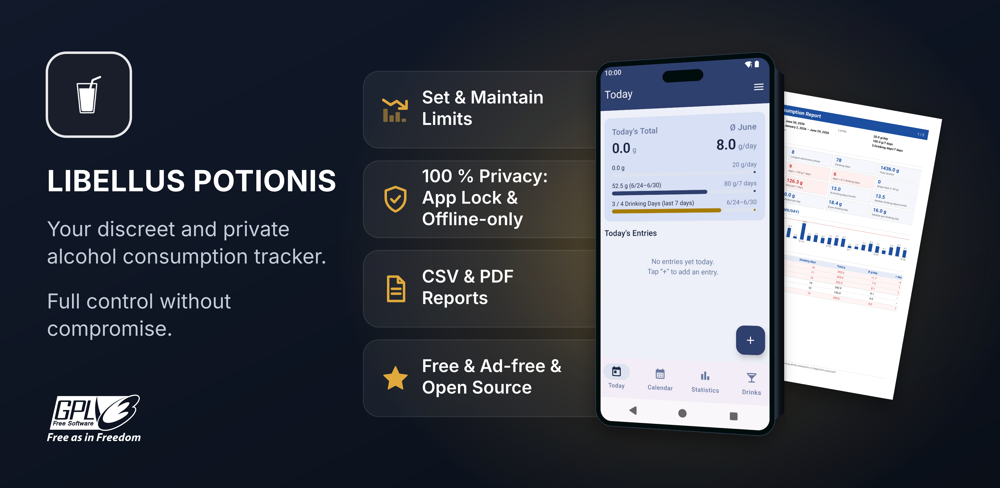

<!-- vim: set et ts=4:
=============================================================================
Libellus Potionis - Privacy-Friendly Alcohol Tracker
Copyright (c) 2026 Martin A. Godisch <martin@godisch.de>
=============================================================================

This program is free software: you can redistribute it and/or modify it under
the terms of the GNU General Public License as published by the Free Software
Foundation, either version 3 of the License, or (at your option) any later
version.

This program is distributed in the hope that it will be useful, but WITHOUT
ANY WARRANTY; without even the implied warranty of MERCHANTABILITY or FITNESS
FOR A PARTICULAR PURPOSE.  See the GNU General Public License for more
details.

You should have received a copy of the GNU General Public License along with
this program.  If not, see <https://www.gnu.org/licenses/>.

In addition, as permitted by section 7 of the GNU General Public License,
this program may carry additional permissions; any such permissions that
apply to it are stated in the accompanying COPYING.md file.

=============================================================================
-->

# Libellus Potionis - Privacy-Friendly Alcohol Tracker

## About the App (v0.85.0)

Libellus Potionis is a privacy-first, open-source, free and ad-free alcohol
consumption tracker designed to help users monitor, pace, and manage their
drinking habits entirely offline. It requires no invasive device permissions,
no camera, microphone, or location access, and operates completely without
network connectivity.

The app runs on both Android and iOS, and is available on
[F-Droid](https://f-droid.org/packages/de.godisch.potillus), on [Google Play
(Beta)](https://play.google.com/store/apps/details?id=de.godisch.potillus), and
on the [App Store (Beta)](https://testflight.apple.com/join/sfJvr3VK).

## Key Features

* Predefine custom beverages or use internationally common presets. Log drinks
  instantly or retroactively with timestamp corrections.
* Set three boundaries at once: a daily limit in grams of pure alcohol, a
  rolling 7-day limit in grams, and a maximum number of drinking days per week.
  Each limit has its own progress bar.
* Enter your body weight to get a live estimate of your blood alcohol
  concentration (BAC): from the Widmark formula.
* Generate a two-page PDF report of your consumption for a counseling
  appointment.
* Export the dataset as a CSV file for external processing (e.g. in
  [LibreOffice](https://www.libreoffice.org/) Calc), or create JSON backups to
  move data between devices.
* Adjust the app to set your own "day start" time, so that late-night drinks
  count toward the preceding evening, or set an evaluation start date for a
  clean restart.

## Quick start

1. Install Libellus Potionis from
   [F-Droid](https://f-droid.org/packages/de.godisch.potillus), [Google Play
   (Beta)](https://play.google.com/store/apps/details?id=de.godisch.potillus),
   or from the [App Store (Beta)](https://testflight.apple.com/join/sfJvr3VK).
2. Log your first drink. Open the app: on the Today screen, tap the plus button
   and pick a beverage. It is logged instantly, and on the Calendar screen you
   can correct and add drinks you had earlier.
3. See where you stand. The Today screen shows the grams of pure alcohol you
   have consumed today, your progress toward the daily and rolling 7-day limits
   as bars, and your drinking-days count for the week.
4. Optional: Edit the presets or define your own beverages on the drinks
   screen.
5. Optional: Personalize. In Settings you can set the daily, weekly and
   drinking-days limits, enter your body weight for a live blood-alcohol (BAC)
   estimate, and enable the fingerprint lock.
6. Optional: Export. Generate a two-page PDF report for a counseling
   appointment, export a CSV for a spreadsheet, or create a JSON backup to move
   your data to another device.

Have a look at the in-app User's Guide which describes every screen.

## Privacy & Security Architecture

The app stores only what you enter. On Android it holds no network permission,
so it is incapable of network access; on iOS, where there is no equivalent
install-time permission, it contains no networking APIs at all. Personal data
therefore does not leave the device on its own. Your data rests in the app's
private, sandboxed storage, protected at rest by the operating system's
file-based storage encryption. An optional biometric lock guards against
unauthorized physical access. There is no tracking, no analytics and no cloud
synchronization.

The app's full privacy policy — detailing exactly what is stored on the device
and confirming that nothing is ever transmitted — is available in
[`PRIVACY.md`](PRIVACY.md).

## Platform Compatibility

The app runs on Android 11 (API 30) and newer and on iOS 17 and newer. It
consists of two separate native apps in this one repository — Kotlin/Jetpack
Compose for Android, Swift/SwiftUI for iOS — that share the same design, the
same feature set, and a common JSON backup format, so a backup exported on one
platform imports on the other. Their behaviour is kept in lock-step by a shared
set of test vectors.

Android API 30 is a deliberate floor: it is the lowest level at which the app
can save CSV, PDF, and backup files to the public `Downloads` folder via
`MediaStore` *without* requesting any runtime storage permissions, which keeps
the minimal-permission profile intact. The hardware floor that follows is e.g.
Google Pixel 5 or Samsung Galaxy S21 and later. The system-level per-app
language picker requires API 33+, so the app carries its own language selector,
which works on every supported version.

iOS 17 is a deliberate floor as well: it is where the SwiftUI Observation
framework and String Catalog localisation the app relies on became available,
while the pre-iOS-17 installed base is a small, shrinking tail. The hardware
floor that follows is iPhone XS (2018) and later. The app's own language
selector works here too, and the JSON backup format is shared with Android, so
a backup moves between the two platforms unchanged.

Libellus Potionis is distributed through
[F-Droid](https://f-droid.org/packages/de.godisch.potillus/), which applies no
age rating. Where the app is offered through the commercial stores, the two
consoles ask different questions and reach very different age ratings for the
same app — Apple's App Store at **18+**, Google Play at **3+** — because one
rates the _content_ (a catalogue of alcoholic drinks) and the other the
_purpose_ (a harm-reduction tool that neither sells nor promotes anything).
What each store asked, what was answered, and why is recorded in
[`docs/STORE_RATINGS.md`](docs/STORE_RATINGS.md).

## Build Infrastructure & Tooling

To build the app from source, follow the step-by-step guides
[`docs/INSTALL-ANDROID.md`](docs/INSTALL-ANDROID.md) and
[`docs/INSTALL-IOS.md`](docs/INSTALL-IOS.md).

Changes are documented in [`CHANGELOG.md`](CHANGELOG.md). The project's
intended direction and its explicit non-goals are described in
[`docs/ROADMAP.md`](docs/ROADMAP.md).

## AI Involvement

This project was developed with assistance from Anthropic's Claude across
implementation, documentation, and tooling. This statement is for transparency:
all changes are reviewed and maintained under the same test suites and quality
standards as human-written code. As with any open-source software provided
under the GPLv3, the code is provided "as is", and users remain responsible for
evaluating its suitability for their own use.

## Feedback & Contributing

The preferred channel for feedback, bug reports, and enhancement requests is
the issue tracker of the canonical repository at
[GitLab](https://gitlab.com/godisch/potillus/-/issues); if you would rather not
use the tracker, you may instead write to
[android@godisch.de](mailto:android@godisch.de) or
[ios@godisch.de](mailto:ios@godisch.de). To report a security vulnerability,
please do _not_ open a public issue. Instead, follow the private, PGP-encrypted
reporting process described in [`SECURITY.md`](SECURITY.md).

Translations contributions are where help is most useful. Most of the 21
interface languages are machine-generated: Czech, Danish, Greek, Spanish,
French, Italian, Japanese, Korean, Dutch, Norwegian, Polish, Portuguese (Brazil
and Portugal), Romanian, Russian, Swedish, Ukrainian, as well as both written
forms of Chinese. If you speak one of them, corrections are a welcome
contribution. The workflow is in [`CONTRIBUTING.md`](CONTRIBUTING.md), section
6.

All contributors are expected to follow the project's [Code of
Conduct](docs/CODE_OF_CONDUCT.md).

## License

Libellus Potionis - Privacy-Friendly Alcohol Tracker, Copyright &copy; 2026
Martin A. Godisch <[martin@godisch.de](mailto:martin@godisch.de)>

The source code can be found at the [canonical repository at
gitlab.com](https://gitlab.com/godisch/potillus/). A read-only push mirror is
available at [github.com](https://github.com/mgodisch/potillus); it carries no
development, but it does run supplementary checks that the canonical pipeline
cannot — see [`docs/MIRROR-CHECKS.md`](docs/MIRROR-CHECKS.md).

This program is free software: you can redistribute it and/or modify it under
the terms of the GNU General Public License as published by the Free Software
Foundation, either version 3 of the License, or (at your option) any later
version.

This program is distributed in the hope that it will be useful, but WITHOUT ANY
WARRANTY; without even the implied warranty of MERCHANTABILITY or FITNESS FOR A
PARTICULAR PURPOSE.  See the GNU General Public License for more details.

You should have received a copy of the GNU General Public License along with
this program.  If not, see
<[https://www.gnu.org/licenses/](https://www.gnu.org/licenses/)>.
